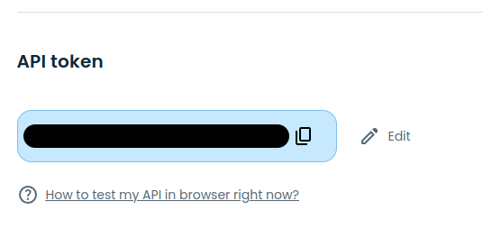

<!-- README.md is generated from README.Rmd. Please edit that file -->

```{r, include = FALSE}
knitr::opts_chunk$set(
  collapse = TRUE,
  comment = "#>",
  fig.path = "man/figures/README-",
  out.width = "100%"
)
```

# About eodhdR2


<!-- badges: start -->
[](https://github.com/EodHistoricalData/R-Library-for-financial-data-2024/actions/workflows/R-CMD-check.yaml)
[](https://codecov.io/github/msperlin/eodhdR2)
<!-- badges: end -->

[eodhd](https://eodhd.com/) is a private company that offers APIs to a set of comprehensive and high quality financial data for over 70+ exchanges across the world. This includes:

* Adjusted and unadjusted prices of financial contracts (equity, funds, ETF, cryptocurrencies, ..)
* Financial information of companies (Balance Sheet, Income/Cashflow statement)
* Valuation indicators
* And [more](https://eodhd.com/)..

Package eodhdR2 is the second and backwards incompatible version of [eodhd](https://github.com/EodHistoricalData/EODHD-APIs-R-Financial-Library), allowing fast and intelligent access to most of the API's endpoints. 


# Features

- A local caching system that saves all API queries to the disk, improving execution time and reducing api calls on repeated queries.
- A quota management system, informing the user of how much of the API daily quota was used and how much time is left to refresh it.
- Function for aggregating and organizing financial information into a single dataframe, allowing easier access to clean financial data in the [wide or long format](https://libguides.princeton.edu/R-reshape#:~:text=A%20dataset%20can%20be%20written,repeat%20in%20the%20first%20column.&text=We%20can%20see%20that%20in,value%20in%20the%20first%20column).


# Installation

```{r, eval=FALSE}
# not yet in CRAN
#install.package("eodhdR2")

# development version
devtools::install_github("EodHistoricalData/R-Library-for-financial-data-2024")
```


# Usage

## Authentication

After registering in the [eodhd website](https://eodhd.com/) and choosing a subscription, all users will authenticate an R session using a token from the website. For that:

1) Create an account at [https://eodhd.com/](https://eodhd.com/)
2) Go in "Settings" and look for your API token



While using `eodhdR2`, all authentications are managed with function `eodhdR2::set_token()`:

```{r, eval=FALSE}
eodhdR2::set_token("YOUR_TOKEN")
```

Alternatively, while testing the API, you can use the "demo" token for demonstration.

```{r, eval=TRUE}
token <- eodhdR2::get_demo_token()
eodhdR2::set_token(token)
```

# Examples

## Retrieving Financial Prices

```{r}
ticker <- "AAPL"
exchange <- "US"

df_prices <- eodhdR2::get_prices(ticker, exchange)

head(df_prices)
```

```{r}
library(ggplot2)

p <- ggplot(df_prices, aes(y = adjusted_close, x = date)) + 
  geom_line() + 
  theme_light() + 
  labs(title = "Adjusted Prices of AAPL",
       subtitle = "Prices are adjusted to splits, dividends and other corporate events",
       x = "Data",
       y = "Adjusted Prices")

p
```

## Retrieving Dividends

```{r}
ticker <- "AAPL"
exchange <- "US"

df_div <- eodhdR2::get_dividends(ticker, exchange)

head(df_div)
```

```{r}
library(ggplot2)

p <- ggplot(df_div, aes(y = value, x = date)) + 
  geom_point(size = 1) + 
  theme_light() + 
  labs(title = "Adjusted Dividends of AAPL",
       x = "Data",
       y = "Adjusted Dividends")

p
```

## Retrieving Fundamentals

```{r}
ticker <- "AAPL"
exchange <- "US"

l_fun <- eodhdR2::get_fundamentals(ticker, exchange)

names(l_fun)
```


## Parsing financials (wide table)

```{r}
wide_financials <- eodhdR2::parse_financials(l_fun, "wide")

head(wide_financials)
```


## Parsing financials (long table)

```{r}
long_financials <- eodhdR2::parse_financials(l_fun, "long")

head(long_financials)
```
