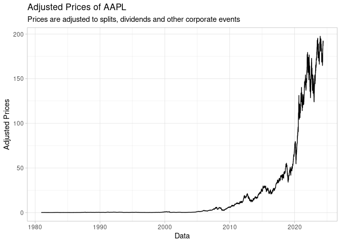

<!-- README.md is generated from README.Rmd. Please edit that file -->

# About eodhd

<!-- badges: start -->
<!-- badges: end -->

[EODHD](https://eodhd.com/) is a private company that offers access to a
set of comprehensive and high quality repositories of financial data for
over 70+ exchanges accross the world.

# Features

- cache
- quota management

## Installation

``` r
# not yet in CRAN
#install.package("eodhd2")

# development version
devtools::install_github("msperlin/eodhd2")
```

## Authentication

``` r
eodhd2::set_token()
#> ✔ eodhd API token set
#> ℹ Account name: API Documentation 2 (supportlevel1@eodhistoricaldata.com)
#> ℹ Quota: 45069 | 10000000
#> ℹ Subscription: demo
#> ✖ You are using a DEMONSTRATION token for testing pourposes, with limited access to the data repositories.
#> See <https://eodhd.com/> for registration and use function set_token(TOKEN) to set your own token.
```

## Usage

## Fetching Financial Prices

``` r
ticker <- "AAPL"
exchange <- "US"

df_prices <- eodhd2::get_prices(ticker, exchange)
#> 
#> ── fetching eod prices for ticker AAPL|US ──────────────────────────────────────
#> ! Quota status: 45069|10000000, refreshing in 10.5 hours
#> ✔    got 10958 rows of prices
#> ℹ    got daily data from 1980-12-12 to 2024-05-31
```

``` r

head(df_prices)
#>         date    open    high     low   close adjusted_close    volume ticker
#> 1 1980-12-12 28.7392 28.8736 28.7392 28.7392         0.0990 469033600   AAPL
#> 2 1980-12-15 27.3728 27.3728 27.2608 27.2608         0.0939 175884800   AAPL
#> 3 1980-12-16 25.3792 25.3792 25.2448 25.2448         0.0870 105728000   AAPL
#> 4 1980-12-17 25.8720 26.0064 25.8720 25.8720         0.0892  86441600   AAPL
#> 5 1980-12-18 26.6336 26.7456 26.6336 26.6336         0.0918  73449600   AAPL
#> 6 1980-12-19 28.2464 28.3808 28.2464 28.2464         0.0973  48630400   AAPL
#>   exchange
#> 1       US
#> 2       US
#> 3       US
#> 4       US
#> 5       US
#> 6       US
```

``` r
library(ggplot2)

p <- ggplot(df_prices, aes(y = adjusted_close, x = date)) + 
  geom_line() + 
  theme_light() + 
  labs(title = "Adjusted Prices of AAPL",
       subtitle = "Prices are adjusted to splits, dividends and other corporate events",
       x = "Data",
       y = "Adjusted Prices")

p
```

 \##
Fetching Fundamentals

``` r
ticker <- "AAPL"
exchange <- "US"

l_fun <- eodhd2::get_fundamentals(ticker, exchange)
#> 
#> ── fetching fundamentals for ticker AAPL|US ────────────────────────────────────
#> ✔ eodhd API token set
#> ℹ Account name: API Documentation 2 (supportlevel1@eodhistoricaldata.com)
#> ℹ Quota: 45072 | 10000000
#> ℹ Subscription: demo
#> ✖ You are using a DEMONSTRATION token for testing pourposes, with limited access to the data repositories.
#> See <https://eodhd.com/> for registration and use function set_token(TOKEN) to set your own token.
#> ! Quota status: 45072|10000000, refreshing in 10.5 hours
#> ✔    querying API
#> ✔    got 13 elements in list
```

``` r

names(l_fun)
#>  [1] "General"             "Highlights"          "Valuation"          
#>  [4] "SharesStats"         "Technicals"          "SplitsDividends"    
#>  [7] "AnalystRatings"      "Holders"             "InsiderTransactions"
#> [10] "ESGScores"           "outstandingShares"   "Earnings"           
#> [13] "Financials"
```

## Parsing financials

``` r
wide_financials <- eodhd2::parse_financials(l_fun, "wide")
#> 
#> ── Parsing financial data for Apple Inc | AAPL ──
#> 
#> ℹ parsing Balance_Sheet  data
#> ℹ    quarterly
#> ℹ    yearly
#> ℹ parsing Cash_Flow  data
#> ℹ    quarterly
#> ℹ    yearly
#> ℹ parsing Income_Statement  data
#> ℹ    quarterly
#> ℹ    yearly
#> ✔ got 561 rows of financial data (wide format)
```

``` r

head(wide_financials)
#> # A tibble: 6 × 127
#>   date       filing_date ticker company_name frequency type_financial
#>   <date>     <date>      <chr>  <chr>        <chr>     <chr>         
#> 1 2024-03-31 2024-05-03  AAPL   Apple Inc    quarterly Balance_Sheet 
#> 2 2023-12-31 2024-02-02  AAPL   Apple Inc    quarterly Balance_Sheet 
#> 3 2023-09-30 2023-11-03  AAPL   Apple Inc    quarterly Balance_Sheet 
#> 4 2023-06-30 2023-08-04  AAPL   Apple Inc    quarterly Balance_Sheet 
#> 5 2023-03-31 2023-05-05  AAPL   Apple Inc    quarterly Balance_Sheet 
#> 6 2022-12-31 2023-02-03  AAPL   Apple Inc    quarterly Balance_Sheet 
#> # ℹ 121 more variables: currency_symbol <chr>, totalAssets <dbl>,
#> #   intangibleAssets <dbl>, earningAssets <dbl>, otherCurrentAssets <dbl>,
#> #   totalLiab <dbl>, totalStockholderEquity <dbl>, deferredLongTermLiab <dbl>,
#> #   otherCurrentLiab <dbl>, commonStock <dbl>, capitalStock <dbl>,
#> #   retainedEarnings <dbl>, otherLiab <dbl>, goodWill <dbl>, otherAssets <dbl>,
#> #   cash <dbl>, cashAndEquivalents <dbl>, totalCurrentLiabilities <dbl>,
#> #   currentDeferredRevenue <dbl>, netDebt <dbl>, shortTermDebt <dbl>, …
```

### A nice table

``` r
long_financials <- eodhd2::parse_financials(l_fun, "long")
#> 
#> ── Parsing financial data for Apple Inc | AAPL ──
#> 
#> ℹ parsing Balance_Sheet  data
#> ℹ    quarterly
#> ℹ    yearly
#> ℹ parsing Cash_Flow  data
#> ℹ    quarterly
#> ℹ    yearly
#> ℹ parsing Income_Statement  data
#> ℹ    quarterly
#> ℹ    yearly
#> ✔ got 67320 rows of financial data (long format)
```

``` r
head(long_financials)
#> # A tibble: 6 × 9
#>   date       filing_date ticker company_name frequency type_financial
#>   <date>     <date>      <chr>  <chr>        <chr>     <chr>         
#> 1 2024-03-31 2024-05-03  AAPL   Apple Inc    quarterly Balance_Sheet 
#> 2 2024-03-31 2024-05-03  AAPL   Apple Inc    quarterly Balance_Sheet 
#> 3 2024-03-31 2024-05-03  AAPL   Apple Inc    quarterly Balance_Sheet 
#> 4 2024-03-31 2024-05-03  AAPL   Apple Inc    quarterly Balance_Sheet 
#> 5 2024-03-31 2024-05-03  AAPL   Apple Inc    quarterly Balance_Sheet 
#> 6 2024-03-31 2024-05-03  AAPL   Apple Inc    quarterly Balance_Sheet 
#> # ℹ 3 more variables: currency_symbol <chr>, name <chr>, value <dbl>
```

``` r

my_date <- as.Date("2023-09-30")
selected_acc <- c("date", "company_name", "frequency", "type_financial", "totalAssets", "cashAndEquivalents", "totalLiab", "totalStockholderEquity",
                  "totalRevenue", "ebitda", "grossProfit", "netIncome")

tb_fin <- long_financials |>
  dplyr::filter(
    name %in% selected_acc,
    date == my_date,
    frequency == "yearly")


tb_fin |>
  dplyr::group_by(type_financial) |>
  gt::gt() |>
  gt::tab_header("Financial Statements of AAPL",
                 "Data for {my_date}") |>
gt::fmt_currency(value)
```

<div id="yxxtnizgmp" style="padding-left:0px;padding-right:0px;padding-top:10px;padding-bottom:10px;overflow-x:auto;overflow-y:auto;width:auto;height:auto;">
<style>#yxxtnizgmp table {
  font-family: system-ui, 'Segoe UI', Roboto, Helvetica, Arial, sans-serif, 'Apple Color Emoji', 'Segoe UI Emoji', 'Segoe UI Symbol', 'Noto Color Emoji';
  -webkit-font-smoothing: antialiased;
  -moz-osx-font-smoothing: grayscale;
}
&#10;#yxxtnizgmp thead, #yxxtnizgmp tbody, #yxxtnizgmp tfoot, #yxxtnizgmp tr, #yxxtnizgmp td, #yxxtnizgmp th {
  border-style: none;
}
&#10;#yxxtnizgmp p {
  margin: 0;
  padding: 0;
}
&#10;#yxxtnizgmp .gt_table {
  display: table;
  border-collapse: collapse;
  line-height: normal;
  margin-left: auto;
  margin-right: auto;
  color: #333333;
  font-size: 16px;
  font-weight: normal;
  font-style: normal;
  background-color: #FFFFFF;
  width: auto;
  border-top-style: solid;
  border-top-width: 2px;
  border-top-color: #A8A8A8;
  border-right-style: none;
  border-right-width: 2px;
  border-right-color: #D3D3D3;
  border-bottom-style: solid;
  border-bottom-width: 2px;
  border-bottom-color: #A8A8A8;
  border-left-style: none;
  border-left-width: 2px;
  border-left-color: #D3D3D3;
}
&#10;#yxxtnizgmp .gt_caption {
  padding-top: 4px;
  padding-bottom: 4px;
}
&#10;#yxxtnizgmp .gt_title {
  color: #333333;
  font-size: 125%;
  font-weight: initial;
  padding-top: 4px;
  padding-bottom: 4px;
  padding-left: 5px;
  padding-right: 5px;
  border-bottom-color: #FFFFFF;
  border-bottom-width: 0;
}
&#10;#yxxtnizgmp .gt_subtitle {
  color: #333333;
  font-size: 85%;
  font-weight: initial;
  padding-top: 3px;
  padding-bottom: 5px;
  padding-left: 5px;
  padding-right: 5px;
  border-top-color: #FFFFFF;
  border-top-width: 0;
}
&#10;#yxxtnizgmp .gt_heading {
  background-color: #FFFFFF;
  text-align: center;
  border-bottom-color: #FFFFFF;
  border-left-style: none;
  border-left-width: 1px;
  border-left-color: #D3D3D3;
  border-right-style: none;
  border-right-width: 1px;
  border-right-color: #D3D3D3;
}
&#10;#yxxtnizgmp .gt_bottom_border {
  border-bottom-style: solid;
  border-bottom-width: 2px;
  border-bottom-color: #D3D3D3;
}
&#10;#yxxtnizgmp .gt_col_headings {
  border-top-style: solid;
  border-top-width: 2px;
  border-top-color: #D3D3D3;
  border-bottom-style: solid;
  border-bottom-width: 2px;
  border-bottom-color: #D3D3D3;
  border-left-style: none;
  border-left-width: 1px;
  border-left-color: #D3D3D3;
  border-right-style: none;
  border-right-width: 1px;
  border-right-color: #D3D3D3;
}
&#10;#yxxtnizgmp .gt_col_heading {
  color: #333333;
  background-color: #FFFFFF;
  font-size: 100%;
  font-weight: normal;
  text-transform: inherit;
  border-left-style: none;
  border-left-width: 1px;
  border-left-color: #D3D3D3;
  border-right-style: none;
  border-right-width: 1px;
  border-right-color: #D3D3D3;
  vertical-align: bottom;
  padding-top: 5px;
  padding-bottom: 6px;
  padding-left: 5px;
  padding-right: 5px;
  overflow-x: hidden;
}
&#10;#yxxtnizgmp .gt_column_spanner_outer {
  color: #333333;
  background-color: #FFFFFF;
  font-size: 100%;
  font-weight: normal;
  text-transform: inherit;
  padding-top: 0;
  padding-bottom: 0;
  padding-left: 4px;
  padding-right: 4px;
}
&#10;#yxxtnizgmp .gt_column_spanner_outer:first-child {
  padding-left: 0;
}
&#10;#yxxtnizgmp .gt_column_spanner_outer:last-child {
  padding-right: 0;
}
&#10;#yxxtnizgmp .gt_column_spanner {
  border-bottom-style: solid;
  border-bottom-width: 2px;
  border-bottom-color: #D3D3D3;
  vertical-align: bottom;
  padding-top: 5px;
  padding-bottom: 5px;
  overflow-x: hidden;
  display: inline-block;
  width: 100%;
}
&#10;#yxxtnizgmp .gt_spanner_row {
  border-bottom-style: hidden;
}
&#10;#yxxtnizgmp .gt_group_heading {
  padding-top: 8px;
  padding-bottom: 8px;
  padding-left: 5px;
  padding-right: 5px;
  color: #333333;
  background-color: #FFFFFF;
  font-size: 100%;
  font-weight: initial;
  text-transform: inherit;
  border-top-style: solid;
  border-top-width: 2px;
  border-top-color: #D3D3D3;
  border-bottom-style: solid;
  border-bottom-width: 2px;
  border-bottom-color: #D3D3D3;
  border-left-style: none;
  border-left-width: 1px;
  border-left-color: #D3D3D3;
  border-right-style: none;
  border-right-width: 1px;
  border-right-color: #D3D3D3;
  vertical-align: middle;
  text-align: left;
}
&#10;#yxxtnizgmp .gt_empty_group_heading {
  padding: 0.5px;
  color: #333333;
  background-color: #FFFFFF;
  font-size: 100%;
  font-weight: initial;
  border-top-style: solid;
  border-top-width: 2px;
  border-top-color: #D3D3D3;
  border-bottom-style: solid;
  border-bottom-width: 2px;
  border-bottom-color: #D3D3D3;
  vertical-align: middle;
}
&#10;#yxxtnizgmp .gt_from_md > :first-child {
  margin-top: 0;
}
&#10;#yxxtnizgmp .gt_from_md > :last-child {
  margin-bottom: 0;
}
&#10;#yxxtnizgmp .gt_row {
  padding-top: 8px;
  padding-bottom: 8px;
  padding-left: 5px;
  padding-right: 5px;
  margin: 10px;
  border-top-style: solid;
  border-top-width: 1px;
  border-top-color: #D3D3D3;
  border-left-style: none;
  border-left-width: 1px;
  border-left-color: #D3D3D3;
  border-right-style: none;
  border-right-width: 1px;
  border-right-color: #D3D3D3;
  vertical-align: middle;
  overflow-x: hidden;
}
&#10;#yxxtnizgmp .gt_stub {
  color: #333333;
  background-color: #FFFFFF;
  font-size: 100%;
  font-weight: initial;
  text-transform: inherit;
  border-right-style: solid;
  border-right-width: 2px;
  border-right-color: #D3D3D3;
  padding-left: 5px;
  padding-right: 5px;
}
&#10;#yxxtnizgmp .gt_stub_row_group {
  color: #333333;
  background-color: #FFFFFF;
  font-size: 100%;
  font-weight: initial;
  text-transform: inherit;
  border-right-style: solid;
  border-right-width: 2px;
  border-right-color: #D3D3D3;
  padding-left: 5px;
  padding-right: 5px;
  vertical-align: top;
}
&#10;#yxxtnizgmp .gt_row_group_first td {
  border-top-width: 2px;
}
&#10;#yxxtnizgmp .gt_row_group_first th {
  border-top-width: 2px;
}
&#10;#yxxtnizgmp .gt_summary_row {
  color: #333333;
  background-color: #FFFFFF;
  text-transform: inherit;
  padding-top: 8px;
  padding-bottom: 8px;
  padding-left: 5px;
  padding-right: 5px;
}
&#10;#yxxtnizgmp .gt_first_summary_row {
  border-top-style: solid;
  border-top-color: #D3D3D3;
}
&#10;#yxxtnizgmp .gt_first_summary_row.thick {
  border-top-width: 2px;
}
&#10;#yxxtnizgmp .gt_last_summary_row {
  padding-top: 8px;
  padding-bottom: 8px;
  padding-left: 5px;
  padding-right: 5px;
  border-bottom-style: solid;
  border-bottom-width: 2px;
  border-bottom-color: #D3D3D3;
}
&#10;#yxxtnizgmp .gt_grand_summary_row {
  color: #333333;
  background-color: #FFFFFF;
  text-transform: inherit;
  padding-top: 8px;
  padding-bottom: 8px;
  padding-left: 5px;
  padding-right: 5px;
}
&#10;#yxxtnizgmp .gt_first_grand_summary_row {
  padding-top: 8px;
  padding-bottom: 8px;
  padding-left: 5px;
  padding-right: 5px;
  border-top-style: double;
  border-top-width: 6px;
  border-top-color: #D3D3D3;
}
&#10;#yxxtnizgmp .gt_last_grand_summary_row_top {
  padding-top: 8px;
  padding-bottom: 8px;
  padding-left: 5px;
  padding-right: 5px;
  border-bottom-style: double;
  border-bottom-width: 6px;
  border-bottom-color: #D3D3D3;
}
&#10;#yxxtnizgmp .gt_striped {
  background-color: rgba(128, 128, 128, 0.05);
}
&#10;#yxxtnizgmp .gt_table_body {
  border-top-style: solid;
  border-top-width: 2px;
  border-top-color: #D3D3D3;
  border-bottom-style: solid;
  border-bottom-width: 2px;
  border-bottom-color: #D3D3D3;
}
&#10;#yxxtnizgmp .gt_footnotes {
  color: #333333;
  background-color: #FFFFFF;
  border-bottom-style: none;
  border-bottom-width: 2px;
  border-bottom-color: #D3D3D3;
  border-left-style: none;
  border-left-width: 2px;
  border-left-color: #D3D3D3;
  border-right-style: none;
  border-right-width: 2px;
  border-right-color: #D3D3D3;
}
&#10;#yxxtnizgmp .gt_footnote {
  margin: 0px;
  font-size: 90%;
  padding-top: 4px;
  padding-bottom: 4px;
  padding-left: 5px;
  padding-right: 5px;
}
&#10;#yxxtnizgmp .gt_sourcenotes {
  color: #333333;
  background-color: #FFFFFF;
  border-bottom-style: none;
  border-bottom-width: 2px;
  border-bottom-color: #D3D3D3;
  border-left-style: none;
  border-left-width: 2px;
  border-left-color: #D3D3D3;
  border-right-style: none;
  border-right-width: 2px;
  border-right-color: #D3D3D3;
}
&#10;#yxxtnizgmp .gt_sourcenote {
  font-size: 90%;
  padding-top: 4px;
  padding-bottom: 4px;
  padding-left: 5px;
  padding-right: 5px;
}
&#10;#yxxtnizgmp .gt_left {
  text-align: left;
}
&#10;#yxxtnizgmp .gt_center {
  text-align: center;
}
&#10;#yxxtnizgmp .gt_right {
  text-align: right;
  font-variant-numeric: tabular-nums;
}
&#10;#yxxtnizgmp .gt_font_normal {
  font-weight: normal;
}
&#10;#yxxtnizgmp .gt_font_bold {
  font-weight: bold;
}
&#10;#yxxtnizgmp .gt_font_italic {
  font-style: italic;
}
&#10;#yxxtnizgmp .gt_super {
  font-size: 65%;
}
&#10;#yxxtnizgmp .gt_footnote_marks {
  font-size: 75%;
  vertical-align: 0.4em;
  position: initial;
}
&#10;#yxxtnizgmp .gt_asterisk {
  font-size: 100%;
  vertical-align: 0;
}
&#10;#yxxtnizgmp .gt_indent_1 {
  text-indent: 5px;
}
&#10;#yxxtnizgmp .gt_indent_2 {
  text-indent: 10px;
}
&#10;#yxxtnizgmp .gt_indent_3 {
  text-indent: 15px;
}
&#10;#yxxtnizgmp .gt_indent_4 {
  text-indent: 20px;
}
&#10;#yxxtnizgmp .gt_indent_5 {
  text-indent: 25px;
}
</style>
<table class="gt_table" data-quarto-disable-processing="false" data-quarto-bootstrap="false">
  <thead>
    <tr class="gt_heading">
      <td colspan="8" class="gt_heading gt_title gt_font_normal" style>Financial Statements of AAPL</td>
    </tr>
    <tr class="gt_heading">
      <td colspan="8" class="gt_heading gt_subtitle gt_font_normal gt_bottom_border" style>Data for {my_date}</td>
    </tr>
    <tr class="gt_col_headings">
      <th class="gt_col_heading gt_columns_bottom_border gt_right" rowspan="1" colspan="1" scope="col" id="date">date</th>
      <th class="gt_col_heading gt_columns_bottom_border gt_right" rowspan="1" colspan="1" scope="col" id="filing_date">filing_date</th>
      <th class="gt_col_heading gt_columns_bottom_border gt_left" rowspan="1" colspan="1" scope="col" id="ticker">ticker</th>
      <th class="gt_col_heading gt_columns_bottom_border gt_left" rowspan="1" colspan="1" scope="col" id="company_name">company_name</th>
      <th class="gt_col_heading gt_columns_bottom_border gt_left" rowspan="1" colspan="1" scope="col" id="frequency">frequency</th>
      <th class="gt_col_heading gt_columns_bottom_border gt_left" rowspan="1" colspan="1" scope="col" id="currency_symbol">currency_symbol</th>
      <th class="gt_col_heading gt_columns_bottom_border gt_left" rowspan="1" colspan="1" scope="col" id="name">name</th>
      <th class="gt_col_heading gt_columns_bottom_border gt_right" rowspan="1" colspan="1" scope="col" id="value">value</th>
    </tr>
  </thead>
  <tbody class="gt_table_body">
    <tr class="gt_group_heading_row">
      <th colspan="8" class="gt_group_heading" scope="colgroup" id="Balance_Sheet">Balance_Sheet</th>
    </tr>
    <tr class="gt_row_group_first"><td headers="Balance_Sheet  date" class="gt_row gt_right">2023-09-30</td>
<td headers="Balance_Sheet  filing_date" class="gt_row gt_right">2023-11-03</td>
<td headers="Balance_Sheet  ticker" class="gt_row gt_left">AAPL</td>
<td headers="Balance_Sheet  company_name" class="gt_row gt_left">Apple Inc</td>
<td headers="Balance_Sheet  frequency" class="gt_row gt_left">yearly</td>
<td headers="Balance_Sheet  currency_symbol" class="gt_row gt_left">USD</td>
<td headers="Balance_Sheet  name" class="gt_row gt_left">totalAssets</td>
<td headers="Balance_Sheet  value" class="gt_row gt_right">$352,583,000,000.00</td></tr>
    <tr><td headers="Balance_Sheet  date" class="gt_row gt_right">2023-09-30</td>
<td headers="Balance_Sheet  filing_date" class="gt_row gt_right">2023-11-03</td>
<td headers="Balance_Sheet  ticker" class="gt_row gt_left">AAPL</td>
<td headers="Balance_Sheet  company_name" class="gt_row gt_left">Apple Inc</td>
<td headers="Balance_Sheet  frequency" class="gt_row gt_left">yearly</td>
<td headers="Balance_Sheet  currency_symbol" class="gt_row gt_left">USD</td>
<td headers="Balance_Sheet  name" class="gt_row gt_left">totalLiab</td>
<td headers="Balance_Sheet  value" class="gt_row gt_right">$290,437,000,000.00</td></tr>
    <tr><td headers="Balance_Sheet  date" class="gt_row gt_right">2023-09-30</td>
<td headers="Balance_Sheet  filing_date" class="gt_row gt_right">2023-11-03</td>
<td headers="Balance_Sheet  ticker" class="gt_row gt_left">AAPL</td>
<td headers="Balance_Sheet  company_name" class="gt_row gt_left">Apple Inc</td>
<td headers="Balance_Sheet  frequency" class="gt_row gt_left">yearly</td>
<td headers="Balance_Sheet  currency_symbol" class="gt_row gt_left">USD</td>
<td headers="Balance_Sheet  name" class="gt_row gt_left">totalStockholderEquity</td>
<td headers="Balance_Sheet  value" class="gt_row gt_right">$62,146,000,000.00</td></tr>
    <tr><td headers="Balance_Sheet  date" class="gt_row gt_right">2023-09-30</td>
<td headers="Balance_Sheet  filing_date" class="gt_row gt_right">2023-11-03</td>
<td headers="Balance_Sheet  ticker" class="gt_row gt_left">AAPL</td>
<td headers="Balance_Sheet  company_name" class="gt_row gt_left">Apple Inc</td>
<td headers="Balance_Sheet  frequency" class="gt_row gt_left">yearly</td>
<td headers="Balance_Sheet  currency_symbol" class="gt_row gt_left">USD</td>
<td headers="Balance_Sheet  name" class="gt_row gt_left">cashAndEquivalents</td>
<td headers="Balance_Sheet  value" class="gt_row gt_right">$29,965,000,000.00</td></tr>
    <tr><td headers="Balance_Sheet  date" class="gt_row gt_right">2023-09-30</td>
<td headers="Balance_Sheet  filing_date" class="gt_row gt_right">2023-11-03</td>
<td headers="Balance_Sheet  ticker" class="gt_row gt_left">AAPL</td>
<td headers="Balance_Sheet  company_name" class="gt_row gt_left">Apple Inc</td>
<td headers="Balance_Sheet  frequency" class="gt_row gt_left">yearly</td>
<td headers="Balance_Sheet  currency_symbol" class="gt_row gt_left">USD</td>
<td headers="Balance_Sheet  name" class="gt_row gt_left">netIncome</td>
<td headers="Balance_Sheet  value" class="gt_row gt_right">NA</td></tr>
    <tr><td headers="Balance_Sheet  date" class="gt_row gt_right">2023-09-30</td>
<td headers="Balance_Sheet  filing_date" class="gt_row gt_right">2023-11-03</td>
<td headers="Balance_Sheet  ticker" class="gt_row gt_left">AAPL</td>
<td headers="Balance_Sheet  company_name" class="gt_row gt_left">Apple Inc</td>
<td headers="Balance_Sheet  frequency" class="gt_row gt_left">yearly</td>
<td headers="Balance_Sheet  currency_symbol" class="gt_row gt_left">USD</td>
<td headers="Balance_Sheet  name" class="gt_row gt_left">grossProfit</td>
<td headers="Balance_Sheet  value" class="gt_row gt_right">NA</td></tr>
    <tr><td headers="Balance_Sheet  date" class="gt_row gt_right">2023-09-30</td>
<td headers="Balance_Sheet  filing_date" class="gt_row gt_right">2023-11-03</td>
<td headers="Balance_Sheet  ticker" class="gt_row gt_left">AAPL</td>
<td headers="Balance_Sheet  company_name" class="gt_row gt_left">Apple Inc</td>
<td headers="Balance_Sheet  frequency" class="gt_row gt_left">yearly</td>
<td headers="Balance_Sheet  currency_symbol" class="gt_row gt_left">USD</td>
<td headers="Balance_Sheet  name" class="gt_row gt_left">ebitda</td>
<td headers="Balance_Sheet  value" class="gt_row gt_right">NA</td></tr>
    <tr><td headers="Balance_Sheet  date" class="gt_row gt_right">2023-09-30</td>
<td headers="Balance_Sheet  filing_date" class="gt_row gt_right">2023-11-03</td>
<td headers="Balance_Sheet  ticker" class="gt_row gt_left">AAPL</td>
<td headers="Balance_Sheet  company_name" class="gt_row gt_left">Apple Inc</td>
<td headers="Balance_Sheet  frequency" class="gt_row gt_left">yearly</td>
<td headers="Balance_Sheet  currency_symbol" class="gt_row gt_left">USD</td>
<td headers="Balance_Sheet  name" class="gt_row gt_left">totalRevenue</td>
<td headers="Balance_Sheet  value" class="gt_row gt_right">NA</td></tr>
    <tr class="gt_group_heading_row">
      <th colspan="8" class="gt_group_heading" scope="colgroup" id="Cash_Flow">Cash_Flow</th>
    </tr>
    <tr class="gt_row_group_first"><td headers="Cash_Flow  date" class="gt_row gt_right">2023-09-30</td>
<td headers="Cash_Flow  filing_date" class="gt_row gt_right">2023-11-03</td>
<td headers="Cash_Flow  ticker" class="gt_row gt_left">AAPL</td>
<td headers="Cash_Flow  company_name" class="gt_row gt_left">Apple Inc</td>
<td headers="Cash_Flow  frequency" class="gt_row gt_left">yearly</td>
<td headers="Cash_Flow  currency_symbol" class="gt_row gt_left">USD</td>
<td headers="Cash_Flow  name" class="gt_row gt_left">totalAssets</td>
<td headers="Cash_Flow  value" class="gt_row gt_right">NA</td></tr>
    <tr><td headers="Cash_Flow  date" class="gt_row gt_right">2023-09-30</td>
<td headers="Cash_Flow  filing_date" class="gt_row gt_right">2023-11-03</td>
<td headers="Cash_Flow  ticker" class="gt_row gt_left">AAPL</td>
<td headers="Cash_Flow  company_name" class="gt_row gt_left">Apple Inc</td>
<td headers="Cash_Flow  frequency" class="gt_row gt_left">yearly</td>
<td headers="Cash_Flow  currency_symbol" class="gt_row gt_left">USD</td>
<td headers="Cash_Flow  name" class="gt_row gt_left">totalLiab</td>
<td headers="Cash_Flow  value" class="gt_row gt_right">NA</td></tr>
    <tr><td headers="Cash_Flow  date" class="gt_row gt_right">2023-09-30</td>
<td headers="Cash_Flow  filing_date" class="gt_row gt_right">2023-11-03</td>
<td headers="Cash_Flow  ticker" class="gt_row gt_left">AAPL</td>
<td headers="Cash_Flow  company_name" class="gt_row gt_left">Apple Inc</td>
<td headers="Cash_Flow  frequency" class="gt_row gt_left">yearly</td>
<td headers="Cash_Flow  currency_symbol" class="gt_row gt_left">USD</td>
<td headers="Cash_Flow  name" class="gt_row gt_left">totalStockholderEquity</td>
<td headers="Cash_Flow  value" class="gt_row gt_right">NA</td></tr>
    <tr><td headers="Cash_Flow  date" class="gt_row gt_right">2023-09-30</td>
<td headers="Cash_Flow  filing_date" class="gt_row gt_right">2023-11-03</td>
<td headers="Cash_Flow  ticker" class="gt_row gt_left">AAPL</td>
<td headers="Cash_Flow  company_name" class="gt_row gt_left">Apple Inc</td>
<td headers="Cash_Flow  frequency" class="gt_row gt_left">yearly</td>
<td headers="Cash_Flow  currency_symbol" class="gt_row gt_left">USD</td>
<td headers="Cash_Flow  name" class="gt_row gt_left">cashAndEquivalents</td>
<td headers="Cash_Flow  value" class="gt_row gt_right">NA</td></tr>
    <tr><td headers="Cash_Flow  date" class="gt_row gt_right">2023-09-30</td>
<td headers="Cash_Flow  filing_date" class="gt_row gt_right">2023-11-03</td>
<td headers="Cash_Flow  ticker" class="gt_row gt_left">AAPL</td>
<td headers="Cash_Flow  company_name" class="gt_row gt_left">Apple Inc</td>
<td headers="Cash_Flow  frequency" class="gt_row gt_left">yearly</td>
<td headers="Cash_Flow  currency_symbol" class="gt_row gt_left">USD</td>
<td headers="Cash_Flow  name" class="gt_row gt_left">netIncome</td>
<td headers="Cash_Flow  value" class="gt_row gt_right">$96,995,000,000.00</td></tr>
    <tr><td headers="Cash_Flow  date" class="gt_row gt_right">2023-09-30</td>
<td headers="Cash_Flow  filing_date" class="gt_row gt_right">2023-11-03</td>
<td headers="Cash_Flow  ticker" class="gt_row gt_left">AAPL</td>
<td headers="Cash_Flow  company_name" class="gt_row gt_left">Apple Inc</td>
<td headers="Cash_Flow  frequency" class="gt_row gt_left">yearly</td>
<td headers="Cash_Flow  currency_symbol" class="gt_row gt_left">USD</td>
<td headers="Cash_Flow  name" class="gt_row gt_left">grossProfit</td>
<td headers="Cash_Flow  value" class="gt_row gt_right">NA</td></tr>
    <tr><td headers="Cash_Flow  date" class="gt_row gt_right">2023-09-30</td>
<td headers="Cash_Flow  filing_date" class="gt_row gt_right">2023-11-03</td>
<td headers="Cash_Flow  ticker" class="gt_row gt_left">AAPL</td>
<td headers="Cash_Flow  company_name" class="gt_row gt_left">Apple Inc</td>
<td headers="Cash_Flow  frequency" class="gt_row gt_left">yearly</td>
<td headers="Cash_Flow  currency_symbol" class="gt_row gt_left">USD</td>
<td headers="Cash_Flow  name" class="gt_row gt_left">ebitda</td>
<td headers="Cash_Flow  value" class="gt_row gt_right">NA</td></tr>
    <tr><td headers="Cash_Flow  date" class="gt_row gt_right">2023-09-30</td>
<td headers="Cash_Flow  filing_date" class="gt_row gt_right">2023-11-03</td>
<td headers="Cash_Flow  ticker" class="gt_row gt_left">AAPL</td>
<td headers="Cash_Flow  company_name" class="gt_row gt_left">Apple Inc</td>
<td headers="Cash_Flow  frequency" class="gt_row gt_left">yearly</td>
<td headers="Cash_Flow  currency_symbol" class="gt_row gt_left">USD</td>
<td headers="Cash_Flow  name" class="gt_row gt_left">totalRevenue</td>
<td headers="Cash_Flow  value" class="gt_row gt_right">NA</td></tr>
    <tr class="gt_group_heading_row">
      <th colspan="8" class="gt_group_heading" scope="colgroup" id="Income_Statement">Income_Statement</th>
    </tr>
    <tr class="gt_row_group_first"><td headers="Income_Statement  date" class="gt_row gt_right">2023-09-30</td>
<td headers="Income_Statement  filing_date" class="gt_row gt_right">2023-11-03</td>
<td headers="Income_Statement  ticker" class="gt_row gt_left">AAPL</td>
<td headers="Income_Statement  company_name" class="gt_row gt_left">Apple Inc</td>
<td headers="Income_Statement  frequency" class="gt_row gt_left">yearly</td>
<td headers="Income_Statement  currency_symbol" class="gt_row gt_left">USD</td>
<td headers="Income_Statement  name" class="gt_row gt_left">totalAssets</td>
<td headers="Income_Statement  value" class="gt_row gt_right">NA</td></tr>
    <tr><td headers="Income_Statement  date" class="gt_row gt_right">2023-09-30</td>
<td headers="Income_Statement  filing_date" class="gt_row gt_right">2023-11-03</td>
<td headers="Income_Statement  ticker" class="gt_row gt_left">AAPL</td>
<td headers="Income_Statement  company_name" class="gt_row gt_left">Apple Inc</td>
<td headers="Income_Statement  frequency" class="gt_row gt_left">yearly</td>
<td headers="Income_Statement  currency_symbol" class="gt_row gt_left">USD</td>
<td headers="Income_Statement  name" class="gt_row gt_left">totalLiab</td>
<td headers="Income_Statement  value" class="gt_row gt_right">NA</td></tr>
    <tr><td headers="Income_Statement  date" class="gt_row gt_right">2023-09-30</td>
<td headers="Income_Statement  filing_date" class="gt_row gt_right">2023-11-03</td>
<td headers="Income_Statement  ticker" class="gt_row gt_left">AAPL</td>
<td headers="Income_Statement  company_name" class="gt_row gt_left">Apple Inc</td>
<td headers="Income_Statement  frequency" class="gt_row gt_left">yearly</td>
<td headers="Income_Statement  currency_symbol" class="gt_row gt_left">USD</td>
<td headers="Income_Statement  name" class="gt_row gt_left">totalStockholderEquity</td>
<td headers="Income_Statement  value" class="gt_row gt_right">NA</td></tr>
    <tr><td headers="Income_Statement  date" class="gt_row gt_right">2023-09-30</td>
<td headers="Income_Statement  filing_date" class="gt_row gt_right">2023-11-03</td>
<td headers="Income_Statement  ticker" class="gt_row gt_left">AAPL</td>
<td headers="Income_Statement  company_name" class="gt_row gt_left">Apple Inc</td>
<td headers="Income_Statement  frequency" class="gt_row gt_left">yearly</td>
<td headers="Income_Statement  currency_symbol" class="gt_row gt_left">USD</td>
<td headers="Income_Statement  name" class="gt_row gt_left">cashAndEquivalents</td>
<td headers="Income_Statement  value" class="gt_row gt_right">NA</td></tr>
    <tr><td headers="Income_Statement  date" class="gt_row gt_right">2023-09-30</td>
<td headers="Income_Statement  filing_date" class="gt_row gt_right">2023-11-03</td>
<td headers="Income_Statement  ticker" class="gt_row gt_left">AAPL</td>
<td headers="Income_Statement  company_name" class="gt_row gt_left">Apple Inc</td>
<td headers="Income_Statement  frequency" class="gt_row gt_left">yearly</td>
<td headers="Income_Statement  currency_symbol" class="gt_row gt_left">USD</td>
<td headers="Income_Statement  name" class="gt_row gt_left">netIncome</td>
<td headers="Income_Statement  value" class="gt_row gt_right">$96,995,000,000.00</td></tr>
    <tr><td headers="Income_Statement  date" class="gt_row gt_right">2023-09-30</td>
<td headers="Income_Statement  filing_date" class="gt_row gt_right">2023-11-03</td>
<td headers="Income_Statement  ticker" class="gt_row gt_left">AAPL</td>
<td headers="Income_Statement  company_name" class="gt_row gt_left">Apple Inc</td>
<td headers="Income_Statement  frequency" class="gt_row gt_left">yearly</td>
<td headers="Income_Statement  currency_symbol" class="gt_row gt_left">USD</td>
<td headers="Income_Statement  name" class="gt_row gt_left">grossProfit</td>
<td headers="Income_Statement  value" class="gt_row gt_right">$169,148,000,000.00</td></tr>
    <tr><td headers="Income_Statement  date" class="gt_row gt_right">2023-09-30</td>
<td headers="Income_Statement  filing_date" class="gt_row gt_right">2023-11-03</td>
<td headers="Income_Statement  ticker" class="gt_row gt_left">AAPL</td>
<td headers="Income_Statement  company_name" class="gt_row gt_left">Apple Inc</td>
<td headers="Income_Statement  frequency" class="gt_row gt_left">yearly</td>
<td headers="Income_Statement  currency_symbol" class="gt_row gt_left">USD</td>
<td headers="Income_Statement  name" class="gt_row gt_left">ebitda</td>
<td headers="Income_Statement  value" class="gt_row gt_right">$125,820,000,000.00</td></tr>
    <tr><td headers="Income_Statement  date" class="gt_row gt_right">2023-09-30</td>
<td headers="Income_Statement  filing_date" class="gt_row gt_right">2023-11-03</td>
<td headers="Income_Statement  ticker" class="gt_row gt_left">AAPL</td>
<td headers="Income_Statement  company_name" class="gt_row gt_left">Apple Inc</td>
<td headers="Income_Statement  frequency" class="gt_row gt_left">yearly</td>
<td headers="Income_Statement  currency_symbol" class="gt_row gt_left">USD</td>
<td headers="Income_Statement  name" class="gt_row gt_left">totalRevenue</td>
<td headers="Income_Statement  value" class="gt_row gt_right">$383,285,000,000.00</td></tr>
  </tbody>
  &#10;  
</table>
</div>
