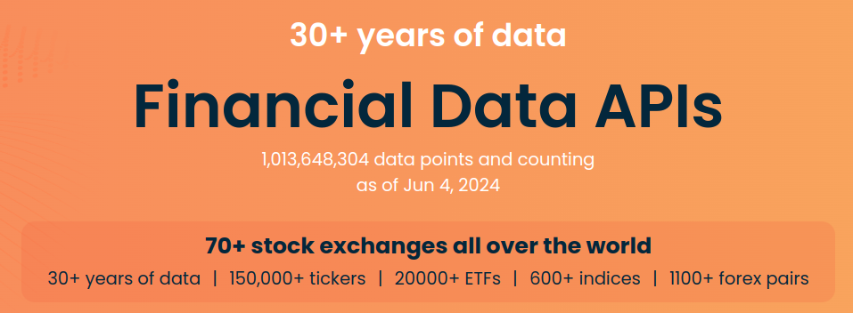
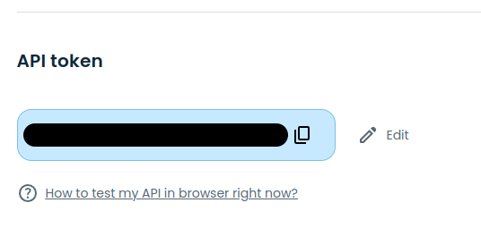
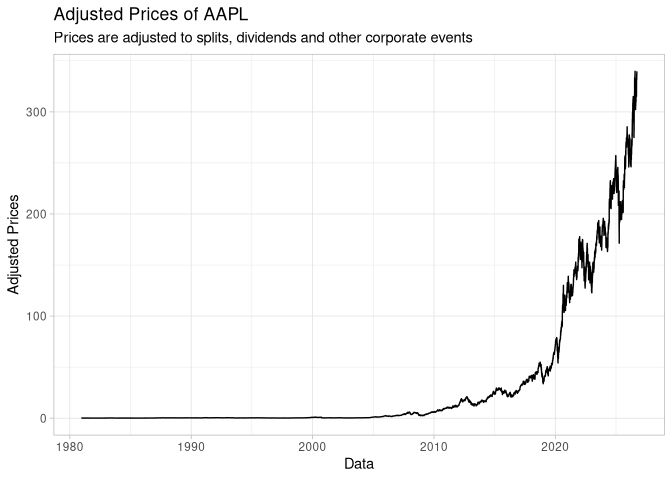
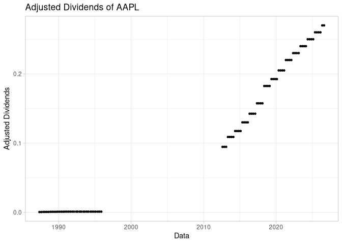

<!-- README.md is generated from README.Rmd. Please edit that file -->

# About eodhdR2



<!-- badges: start -->

[](https://github.com/EodHistoricalData/R-Library-for-financial-data-2024/actions/workflows/R-CMD-check.yaml)
<!-- badges: end -->

[eodhd](https://eodhd.com/) is a private company that offers APIs to a
set of comprehensive and high quality financial data for over 70+
exchanges across the world. This includes:

- Adjusted and unadjusted prices of financial contracts (equity, funds,
  ETF, cryptocurrencies, ..)
- Financial information of companies (Balance Sheet, Income/Cashflow
  statement)
- Valuation indicators
- And [more](https://eodhd.com/)..

Package eodhdR2 is the second and backwards incompatible version of
[eodhd](https://github.com/EodHistoricalData/EODHD-APIs-R-Financial-Library),
allowing fast and intelligent access to most of the API’s endpoints.

# Features

- A local caching system that saves API queries to the disk, improving
  execution time and reducing api calls on repeated queries (live quotes
  are never cached).

- A quota management system, informing the user of how much of the API
  daily quota was used and how much time is left to refresh it.

- Function for aggregating and organizing financial information into a
  single dataframe, allowing easier access to clean financial data in
  the [wide or long
  format](https://libguides.princeton.edu/R-reshape#:~:text=A%20dataset%20can%20be%20written,repeat%20in%20the%20first%20column.&text=We%20can%20see%20that%20in,value%20in%20the%20first%20column).

- Wrappers for every main endpoint of the API, from prices and
  fundamentals to options, macro series and sanctions lists (see
  Coverage below), plus `get_eodhd()` as a generic interface to any
  endpoint without a dedicated function.

# Coverage

| Family | Functions |
|----|----|
| Prices and quotes | `get_prices()`, `get_intraday()`, `get_ticks()`, `get_real_time()`, `get_us_quote_delayed()` |
| Company data | `get_fundamentals()`, `parse_financials()`, `get_bulk_fundamentals()`, `get_historical_market_cap()`, `get_insider_transactions()` |
| Corporate actions | `get_dividends()`, `get_splits()`, `get_dividends_calendar()`, `get_splits_calendar()` |
| Reference data | `get_tickers()`, `get_exchanges()`, `get_exchange_details()`, `get_search()`, `get_screener()`, `get_symbol_change_history()`, `get_id_mapping()`, `get_technical()` |
| Indices | `get_index_list()`, `get_index_composition()` |
| Calendars | `get_earnings()`, `get_earnings_trends()`, `get_ipos()`, `get_economic_events()` |
| News and sentiment | `get_news()`, `get_sentiments()`, `get_news_word_weights()` |
| Macro and rates | `get_macro_indicator()`, `get_ust_rates()`, `get_policy_rates()`, `get_reference_rates()`, `get_corporate_hqm_yields()`, `get_corporate_cmdi()`, `get_funding_stress_spreads()`, `get_commodities()` |
| Credit risk | `get_sovereign_credit_ratings()`, `get_sovereign_cds_spreads()`, `get_cds_market_aggregates()`, `get_default_spreads()`, `get_sovereign_risk_premium()` |
| Real estate | `get_real_estate()`, `get_real_estate_detailed()`, `get_real_estate_series()`, `get_real_estate_countries()` |
| Sanctions | `get_sanctions_entities()`, `get_sanctions_vessels()`, `get_sanctions_programs()`, `get_sanctions_sources()` |
| Options | `get_options_contracts()`, `get_options_eod()`, `get_options_underlyings()` |
| Bulk | `get_bulk_eod()`, `get_bulk_fundamentals()` |
| Session and account | `set_token()`, `get_demo_token()`, `get_user_info()` |
| Anything else | `get_eodhd()` |

Some endpoints are only available on particular subscriptions. A call to
an endpoint outside your plan returns an explicit error from the API,
not empty data.

# Installation

``` r
# available in CRAN
install.packages("eodhdR2")

# development version
devtools::install_github("EodHistoricalData/R-Library-for-financial-data-2024")
```

# Usage

## Authentication

After registering in the [eodhd website](https://eodhd.com/) and
choosing a subscription, all users will authenticate an R session using
a token from the website. For that:

1)  Create an account at <https://eodhd.com/>
2)  Go in “Settings” and look for your API token



While using `eodhdR2`, all authentications are managed with function
`eodhdR2::set_token()`:

``` r
eodhdR2::set_token("YOUR_TOKEN")
```

Alternatively, while testing the API, you can use the “demo” token for
demonstration.

``` r
token <- eodhdR2::get_demo_token()
eodhdR2::set_token(token)
#> ✔ eodhd API token set
#> ℹ Account name: API Documentation 2 (supportlevel1@eodhistoricaldata.com)
#> ℹ Quota: 380273 | 10000000
#> ℹ Subscription: demo
#> ✖ You are using a **DEMONSTRATION** token for testing purposes, with
#> limited access to the data repositories. See <https://eodhd.com/>
#> for registration and, after finding your token, use it with
#> function eodhdR2::set_token("TOKEN").
```

# Examples

## Retrieving Financial Prices

``` r
ticker <- "AAPL"
exchange <- "US"

df_prices <- eodhdR2::get_prices(ticker, exchange)
#> 
#> ── retrieving price data for ticker AAPL|US ────────────────────────────────────
#> ! Quota status: 380273|10000000, refreshing in 2.77 hours
#> ℹ cache file AAPL_US_eodhd_prices.rds saved
#> ✔ got 11536 rows of prices
#> ℹ got daily data from 1980-12-12 to 2026-09-22

head(df_prices)
#>         date    open    high     low   close adjusted_close    volume ticker
#> 1 1980-12-12 28.7392 28.8736 28.7392 28.7392         0.0981 469033600   AAPL
#> 2 1980-12-15 27.3728 27.3728 27.2608 27.2608         0.0931 175884800   AAPL
#> 3 1980-12-16 25.3792 25.3792 25.2448 25.2448         0.0862 105728000   AAPL
#> 4 1980-12-17 25.8720 26.0064 25.8720 25.8720         0.0883  86441600   AAPL
#> 5 1980-12-18 26.6336 26.7456 26.6336 26.6336         0.0909  73449600   AAPL
#> 6 1980-12-19 28.2464 28.3808 28.2464 28.2464         0.0964  48630400   AAPL
#>   exchange ret_adj_close
#> 1       US            NA
#> 2       US   -0.05096840
#> 3       US   -0.07411386
#> 4       US    0.02436195
#> 5       US    0.02944507
#> 6       US    0.06050605
```

``` r
library(ggplot2)

p <- ggplot(df_prices, aes(y = adjusted_close, x = date)) + 
  geom_line() + 
  theme_light() + 
  labs(title = "Adjusted Prices of AAPL",
       subtitle = "Prices are adjusted to splits, dividends and other corporate events",
       x = "Data",
       y = "Adjusted Prices")

p
```



## Retrieving Dividends

``` r
ticker <- "AAPL"
exchange <- "US"

df_div <- eodhdR2::get_dividends(ticker, exchange)
#> 
#> ── retrieving dividends for ticker AAPL|US ─────────────────────────────────────
#> ! Quota status: 380280|10000000, refreshing in 2.77 hours
#> ℹ cache file AAPL_US_eodhd_dividends.rds saved
#> ✔ got 92 rows of dividend data

head(df_div)
#>         date ticker exchange declarationDate recordDate paymentDate period
#> 1 1987-05-11   AAPL       US      1987-04-22 1987-05-15  1987-06-15   <NA>
#> 2 1987-08-10   AAPL       US      1987-07-31 1987-08-14  1987-09-15   <NA>
#> 3 1987-11-17   AAPL       US      1987-11-13 1987-11-23  1987-12-15   <NA>
#> 4 1988-02-12   AAPL       US      1988-01-29 1988-02-19  1988-03-15   <NA>
#> 5 1988-05-16   AAPL       US      1988-04-29 1988-05-20  1988-06-15   <NA>
#> 6 1988-08-15   AAPL       US      1988-07-25 1988-08-19  1988-09-15   <NA>
#>     value unadjustedValue currency
#> 1 0.00054         0.12096      USD
#> 2 0.00054         0.06048      USD
#> 3 0.00071         0.07952      USD
#> 4 0.00071         0.07952      USD
#> 5 0.00071         0.07952      USD
#> 6 0.00071         0.07952      USD
```

``` r
library(ggplot2)

p <- ggplot(df_div, aes(y = value, x = date)) + 
  geom_point(size = 1) + 
  theme_light() + 
  labs(title = "Adjusted Dividends of AAPL",
       x = "Data",
       y = "Adjusted Dividends")

p
```



## Retrieving Fundamentals

``` r
ticker <- "AAPL"
exchange <- "US"

l_fun <- eodhdR2::get_fundamentals(ticker, exchange)
#> 
#> ── retrieving fundamentals for ticker AAPL|US ──────────────────────────────────
#> ! Quota status: 380301|10000000, refreshing in 2.77 hours
#> ✔ querying API
#> ✔ got 13 elements in raw list

names(l_fun)
#>  [1] "General"             "Highlights"          "Valuation"          
#>  [4] "SharesStats"         "Technicals"          "SplitsDividends"    
#>  [7] "AnalystRatings"      "Holders"             "InsiderTransactions"
#> [10] "ESGScores"           "outstandingShares"   "Earnings"           
#> [13] "Financials"
```

## Parsing financials (wide table)

``` r
wide_financials <- eodhdR2::parse_financials(l_fun, "wide")
#> 
#> ── Parsing financial data for Apple Inc. | AAPL ──
#> 
#> ℹ parsing Balance_Sheet  data
#> ℹ    quarterly
#> ℹ    yearly
#> ℹ parsing Cash_Flow  data
#> ℹ    quarterly
#> ℹ    yearly
#> ℹ parsing Income_Statement  data
#> ℹ    quarterly
#> ℹ    yearly
#> ✔ got 594 rows of financial data (wide format)

head(wide_financials)
#> # A tibble: 6 × 127
#>   date       filing_date ticker company_name frequency type_financial
#>   <date>     <date>      <chr>  <chr>        <chr>     <chr>         
#> 1 2026-06-30 2026-07-31  AAPL   Apple Inc.   quarterly Balance_Sheet 
#> 2 2026-03-31 2026-05-01  AAPL   Apple Inc.   quarterly Balance_Sheet 
#> 3 2025-12-31 2026-01-30  AAPL   Apple Inc.   quarterly Balance_Sheet 
#> 4 2025-09-30 2025-10-31  AAPL   Apple Inc.   quarterly Balance_Sheet 
#> 5 2025-06-30 2025-08-01  AAPL   Apple Inc.   quarterly Balance_Sheet 
#> 6 2025-03-31 2025-05-02  AAPL   Apple Inc.   quarterly Balance_Sheet 
#> # ℹ 121 more variables: currency_symbol <chr>, totalAssets <dbl>,
#> #   intangibleAssets <dbl>, earningAssets <dbl>, otherCurrentAssets <dbl>,
#> #   totalLiab <dbl>, totalStockholderEquity <dbl>, deferredLongTermLiab <dbl>,
#> #   otherCurrentLiab <dbl>, commonStock <dbl>, capitalStock <dbl>,
#> #   retainedEarnings <dbl>, otherLiab <dbl>, goodWill <dbl>, otherAssets <dbl>,
#> #   cash <dbl>, cashAndEquivalents <dbl>, totalCurrentLiabilities <dbl>,
#> #   currentDeferredRevenue <dbl>, netDebt <dbl>, shortTermDebt <dbl>, …
```

## Parsing financials (long table)

``` r
long_financials <- eodhdR2::parse_financials(l_fun, "long")
#> 
#> ── Parsing financial data for Apple Inc. | AAPL ──
#> 
#> ℹ parsing Balance_Sheet  data
#> ℹ    quarterly
#> ℹ    yearly
#> ℹ parsing Cash_Flow  data
#> ℹ    quarterly
#> ℹ    yearly
#> ℹ parsing Income_Statement  data
#> ℹ    quarterly
#> ℹ    yearly
#> ✔ got 71280 rows of financial data (long format)

head(long_financials)
#> # A tibble: 6 × 9
#>   date       filing_date ticker company_name frequency type_financial
#>   <date>     <date>      <chr>  <chr>        <chr>     <chr>         
#> 1 2026-06-30 2026-07-31  AAPL   Apple Inc.   quarterly Balance_Sheet 
#> 2 2026-06-30 2026-07-31  AAPL   Apple Inc.   quarterly Balance_Sheet 
#> 3 2026-06-30 2026-07-31  AAPL   Apple Inc.   quarterly Balance_Sheet 
#> 4 2026-06-30 2026-07-31  AAPL   Apple Inc.   quarterly Balance_Sheet 
#> 5 2026-06-30 2026-07-31  AAPL   Apple Inc.   quarterly Balance_Sheet 
#> 6 2026-06-30 2026-07-31  AAPL   Apple Inc.   quarterly Balance_Sheet 
#> # ℹ 3 more variables: currency_symbol <chr>, name <chr>, value <dbl>
```
